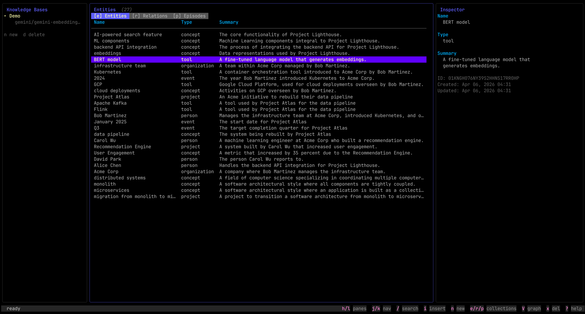
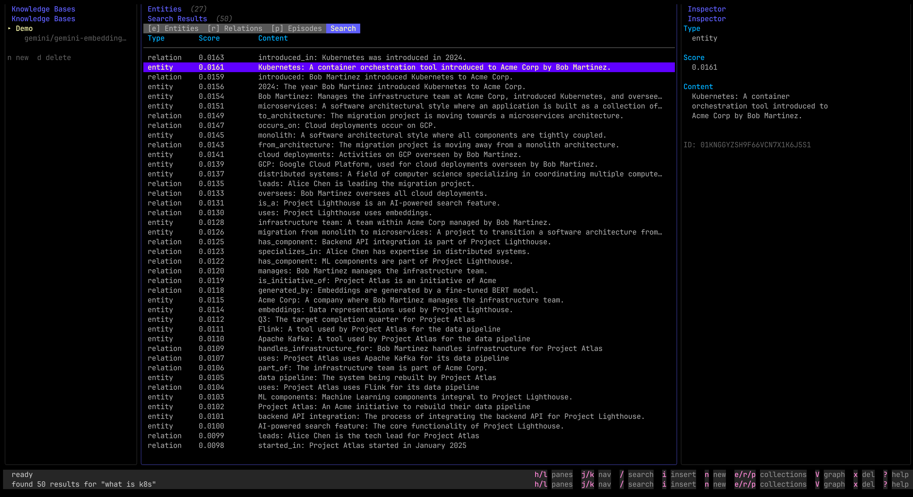
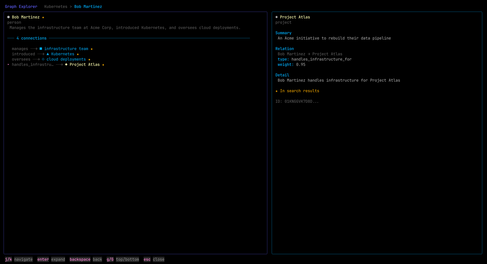

# Memex

A **local-first** temporal knowledge graph memory layer for AI agents. Single Go binary, zero dependencies beyond SQLite. Runs entirely on your machine with Ollama — no API keys required.

Inspired by Vannevar Bush's 1945 vision of a personal knowledge machine, Memex gives AI agents persistent, searchable, graph-structured memory with temporal awareness.





## Features

- **Local First** - Works out of the box with Ollama for both embeddings and LLM — your data never leaves your machine
- **Knowledge Graph** - Entities, relations, and episodes extracted from natural language via LLM
- **Hybrid Search** - BM25 full-text + vector similarity + graph traversal, fused with Reciprocal Rank Fusion
- **Relation Strengthening** - Re-encountering the same fact strengthens existing edges via probability union instead of creating duplicates
- **Temporal Awareness** - Bitemporal relations (valid time + transaction time), memory decay, automatic pruning
- **Multi-Provider** - Ollama (local), OpenAI, Google Gemini, Vertex AI, Azure, Groq for both embeddings and LLM
- **Per-KB Isolation** - Each knowledge base has its own embedding model, LLM, and API keys
- **MCP Server** - Model Context Protocol support for Claude, Cursor, and other MCP-compatible clients
- **REST API** - Full HTTP API with Chi router (20+ endpoints)
- **Terminal UI** - Interactive 3-pane TUI with graph explorer, built with Bubble Tea
- **Entity Resolution** - LLM-powered deduplication with configurable similarity threshold
- **Memory Lifecycle** - Background decay, smart pruning (deduplicates before deleting), entity consolidation with edge merging
- **Async Ingestion** - Background job queue with retries, persistence across restarts
- **Single Binary** - Compiles to one static binary with embedded SQLite, no external dependencies

## Quick Start

```bash
# Build
go build -o memex ./cmd/memex/

# Create a knowledge base with local Ollama (no API keys needed)
# Requires: ollama pull nomic-embed-text && ollama pull llama3.2
./memex kb create my-project --name "My Project"

# Or use a cloud provider
./memex kb create my-project \
  --embed gemini/gemini-embedding-001 \
  --llm gemini/gemini-2.5-flash \
  --name "My Project"

# Store memories
./memex store "Alice is a senior engineer working on Project Atlas" --kb my-project
./memex store "Project Atlas uses Kafka and targets Q3 completion" --kb my-project

# Search
./memex search "who works on Atlas?" --kb my-project

# Launch the TUI
./memex tui

# Start the MCP server (for Claude, Cursor, etc.)
./memex mcp

# Start the HTTP API
./memex serve
```

## Architecture

```
Text Input
    |
    v
+-----------+     +-------------+     +-----------+     +-------------+
| Ingestion | --> | LLM Extract | --> | Entity    | --> | Relation    |
| Queue     |     | (entities,  |     | Resolution|     | Upsert &    |
|           |     |  relations) |     | & Merge   |     | Strengthen  |
+-----------+     +-------------+     +-----------+     +-------------+
                                                              |
                                                              v
                                                      +---------------+
                                                      | Embed & Store |
                                                      | (SQLite +     |
                                                      |  vec index)   |
                                                      +---------------+
                                                              |
                  +-------------------------------------------+
                  |               |               |
                  v               v               v
            +-----------+   +-----------+   +-----------+
            | BM25 FTS  |   | Vector    |   | Graph     |
            | Search    |   | Search    |   | Traversal |
            +-----------+   +-----------+   +-----------+
                  |               |               |
                  +-------+-------+-------+-------+
                          |               |
                          v               v
                    +----------+   +-----------+
                    | RRF      |   | Community |
                    | Fusion   |   | Detection |
                    +----------+   +-----------+
```

## How Memory Strengthening Works

When the same fact is ingested multiple times, Memex recognizes existing relations and strengthens them rather than creating duplicates:

```bash
./memex store "Alice works on Project Atlas" --kb my-project
# Creates: Alice --[WORKS_ON, weight=0.50]--> Project Atlas

./memex store "Alice is working on the Atlas project" --kb my-project
# Strengthens: Alice --[WORKS_ON, weight=0.75]--> Project Atlas (not a duplicate)
```

Weights are combined using probability union: `w = 1 - (1-a)(1-b)`, bounded to [0, 1] and monotonically increasing with each observation. This means frequently mentioned facts become high-confidence edges in the graph.

During lifecycle management:
- **Consolidation** merges duplicate entities and deduplicates any resulting duplicate edges
- **Pruning** deduplicates fragmented relations before deleting — combined weight may exceed the prune threshold, saving them from deletion

## Providers

| Provider | Embeddings | LLM | Config prefix |
|----------|-----------|-----|---------------|
| Ollama | nomic-embed-text, etc. | llama3.2, etc. | `ollama/` |
| OpenAI | text-embedding-3-small | gpt-4o-mini | `openai/` |
| Google Gemini | gemini-embedding-001 | gemini-2.5-flash | `gemini/` |
| Vertex AI | textembedding-gecko | gemini-2.5-flash | `vertex/` |
| Azure OpenAI | text-embedding-3-small | gpt-4o-mini | `azure/` |
| Groq | -- | llama-3.3-70b | `groq/` |

## CLI Reference

```
memex version                              Print version
memex kb create <id> [flags]               Create a knowledge base
memex kb list [flags]                      List knowledge bases
memex kb delete <id> [flags]               Delete a knowledge base
memex store <text> --kb <id> [flags]       Store a memory
memex search <query> --kb <id> [flags]     Hybrid search
memex jobs [--kb <id>] [--status <s>]      List ingestion jobs
memex stats [--kb <id>] [flags]            Show statistics
memex serve [flags]                        Start HTTP API server
memex mcp [flags]                          Start MCP server (stdio)
memex tui [flags]                          Launch interactive terminal UI
```

### KB Creation Flags

```
--embed <provider/model>    Embedding provider and model (default: ollama/nomic-embed-text)
--llm <provider/model>      LLM provider and model (default: ollama/llama3.2)
--name <name>               Display name
--desc <description>        Description
--db <path>                 Database path (default: ~/.memex/memex.db)
```

## MCP Integration

Add to your Claude Desktop or Cursor MCP config:

```json
{
  "mcpServers": {
    "memex": {
      "command": "/path/to/memex",
      "args": ["mcp", "--db", "/path/to/memex.db"]
    }
  }
}
```

Available MCP tools:

| Tool | Description |
|------|-------------|
| `memex_store` | Store a memory into a knowledge base |
| `memex_search` | Hybrid search across the knowledge graph |
| `memex_list_kbs` | List all knowledge bases |
| `memex_create_kb` | Create a new knowledge base |
| `memex_delete_kb` | Delete a knowledge base |
| `memex_get_entity` | Get entity details by ID |
| `memex_get_relations` | Get relations for an entity |
| `memex_get_stats` | Get knowledge base statistics |
| `memex_lifecycle_decay` | Run memory decay on a KB |
| `memex_lifecycle_prune` | Prune weak memories |
| `memex_lifecycle_consolidate` | Merge duplicate entities |

## HTTP API

Start with `memex serve --host 127.0.0.1 --port 8080`.

| Method | Path | Description |
|--------|------|-------------|
| GET | `/health` | Health check |
| POST | `/api/v1/kb` | Create KB |
| GET | `/api/v1/kb` | List KBs |
| GET | `/api/v1/kb/{id}` | Get KB |
| DELETE | `/api/v1/kb/{id}` | Delete KB |
| POST | `/api/v1/kb/{id}/store` | Store memory |
| POST | `/api/v1/kb/{id}/search` | Hybrid search |
| GET | `/api/v1/kb/{id}/entities` | List entities |
| GET | `/api/v1/kb/{id}/entities/{eid}` | Get entity |
| DELETE | `/api/v1/kb/{id}/entities/{eid}` | Delete entity |
| GET | `/api/v1/kb/{id}/relations` | List relations |
| GET | `/api/v1/kb/{id}/episodes` | List episodes |
| GET | `/api/v1/kb/{id}/communities` | List communities |
| GET | `/api/v1/kb/{id}/stats` | Get stats |
| POST | `/api/v1/kb/{id}/decay` | Run decay |
| POST | `/api/v1/kb/{id}/prune` | Run prune |
| POST | `/api/v1/kb/{id}/consolidate` | Run consolidation |

## Terminal UI

Launch with `memex tui`. Vim-style navigation:

| Key | Action |
|-----|--------|
| `h`/`l` | Switch panes (KB, Content, Inspector) |
| `j`/`k` | Navigate items |
| `g`/`G` | Jump to first/last |
| `/` | Search |
| `i` | Insert memory |
| `n` | Create new KB (wizard) |
| `e`/`r`/`p` | Switch collection (entities/relations/episodes) |
| `V` | Graph explorer |
| `x`/`d` | Delete item/KB |
| `s` | Stats |
| `?` | Help |

## Development

```bash
# Build
go build -o memex ./cmd/memex/

# Run tests
go test ./...

# Run with verbose logging
MEMEX_LOG=debug ./memex tui

# Seed example data
export GEMINI_API_KEY="your-key"
./examples/seed.sh
```

## License

MIT - see [LICENSE](LICENSE).
